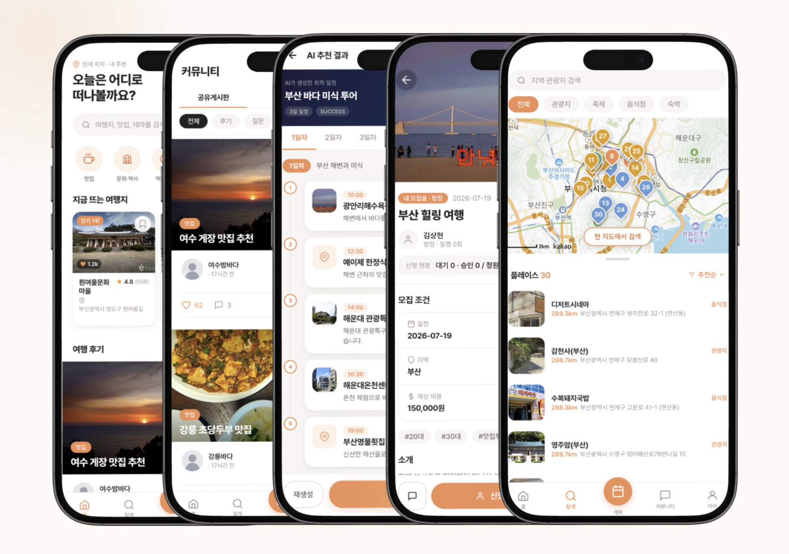
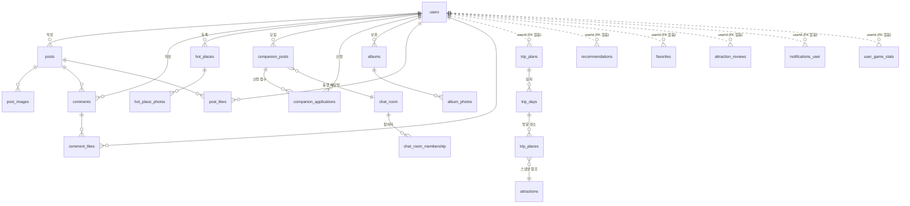
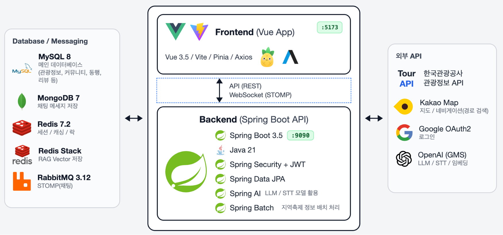
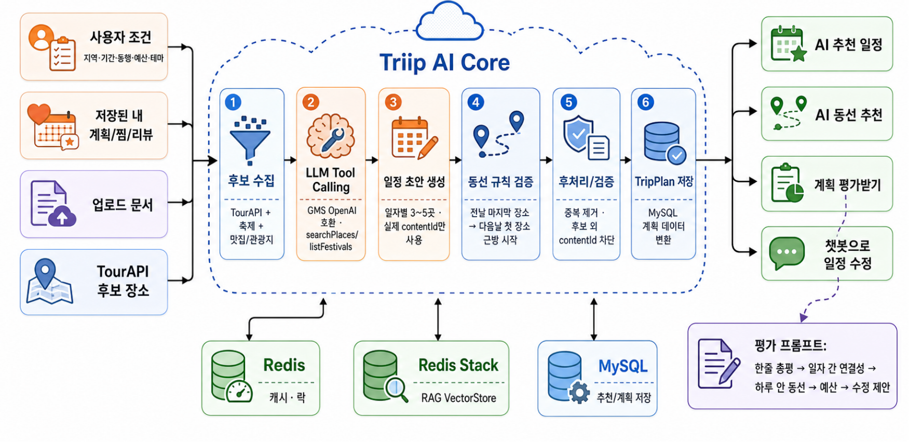

# triip

생성형 AI 기반 관광정보/여행 플랫폼
> 여행지 탐색 · 일정 계획 · 커뮤니티 · 동행 모집 · 실시간 채팅 · AI 어시스턴트를 한 플랫폼에서



| 구분 | 내용 |
|---|---|
| **웹앱** | http://localhost:5173 |
| **API** | http://localhost:9090 |
| **API 문서(Swagger)** | http://localhost:9090/swagger-ui/index.html |

---

## 목차

1. [프로젝트 개요](#1-프로젝트-개요)
2. [팀원 구성](#2-팀원-구성)
3. [개발 기간](#3-개발-기간)
4. [기술 스택](#4-기술-스택)
5. [개발 환경](#5-개발-환경)
6. [ERD](#6-erd)
7. [API 명세](#7-api-명세)
8. [시스템 아키텍처](#8-시스템-아키텍처)
9. [기능 소개](#9-기능-소개)

---

## 1. 프로젝트 개요

**triip**은 "여행지를 찾는 것"에서 끝나지 않고, **찾고 → 계획하고 → 함께 갈 사람을 모으고 → 다녀와서 공유하는** 여행의 전체 흐름을 하나의 앱에서 다루는 것을 목표로 한 프로젝트입니다.

- **실데이터 기반 탐색** 
    - **한국관광공사 TourAPI**를 프록시·캐싱하여 관광지·축제 정보를 제공
    - 계획에 담긴 장소는 스냅샷으로 영속화
- **AI 일정 생성 (RAG 응용)**
    - 조건(지역·기간·동행·예산·테마)을 입력하면 :  Spring AI가 후보 장소 풀 안에서만 일정을 구성
    - 후보 밖 장소를 제거하는 검증 단계로 환각을 억제
    - 사용자가 업로드한 문서(txt/pdf)는 Redis 벡터스토어에 색인되어 AI 일정 어시스턴트의 참고 자료로 활용
- **소셜 플랫폼**
    - **커뮤니티** : 게시글 / 핫플레이스 등록(관리자 승인제)
    - **동행** : 모집과 승인 / 동행 채팅방(STOMP over RabbitMQ)
- **부가 기능**
    - 게임화(뱃지·레벨·퀘스트), 체크리스트, 앨범/계획 공유 링크, 알림(SSE)

<br>

## 2. 팀원 구성


| 담당 | 이름 |
|---|---|
| 백엔드 | 김상현 |
| AI | 김규민 |

---

## 3. 개발 기간

**2026-06-12 ~ 2026-06-26 (2주)**

#### 시스템 설계 문서([BE/docs/system-design.md](BE/docs/system-design.md))

| 단계 | 내용 |
|---|---|
| M0 정비 | 시크릿 env 분리, 의존성 추가, Swagger, GMS 연동 스모크 테스트, 스키마 스냅샷 |
| M1 탐색 | TourAPI 프록시 + Redis 캐시 + 축제 배치 / FE 홈·탐색·상세 |
| M2 인증 | JWT + refresh 회전·재사용 탐지, Google OAuth2, logout/withdraw 세션 정리 |
| M3 계획 | 계획 CRUD, 일자·장소 구성, 낙관적 잠금(version) |
| M4 AI 추천 | RAG 파이프라인, 분산 락, save-plan 멱등, PARTIAL 정책 |
| M5 마감 | 통합 테스트, 에러 UX, 시연 시나리오 |

- 이후 설계 문서의 MVP 범위를 넘어 **커뮤니티·핫플레이스·동행·채팅·게임화·앨범·관리자** 도메인까지 확장 구현

---

## 4. 기술 스택

### Backend

| 분류 | 기술 |
|---|---|
| **Language / Runtime** |  |
| **Framework** |   |
| **데이터 접근** |     |
| **인증 · 보안** |    |
| **AI** |     |
| **메시징** |   |
| **배치** |  |
| **문서화** |  |
| **기타** |    |

### Frontend

| 분류 | 기술 |
|---|---|
| **Framework** |  |
| **빌드** |  |
| **상태 관리** |  |
| **라우팅** |  |
| **HTTP** |  |
| **실시간** |  |
| **지도** |  |


### Infra / External

| 분류 | 기술 |
|---|---|
| **DB** |   |
| **캐시 · 세션** |  |
| **벡터 DB** |  |
| **브로커** |  |
| **컨테이너** |   |
| **외부 API** |     |

<br>

## 5. 개발 환경

### 개발 도구
| 분류 | 환경 | 
| --- | --- |
| **Backend** |   IntelliJ IDEA 2024.2.3 Ultimate Edition |
| **Frontend** |   Visual Studio Code |

### 요구 사항
- Docker Desktop
- 로컬 부분 실행 시: JDK 21, Node.js 20+

### 실행

```bash
cp .env.example .env    # Windows PowerShell: Copy-Item .env.example .env
docker compose up -d --build
```

- 인프라 5종 + 백엔드 + 프론트엔드가 한 번에 기동
- 첫 기동 시 `db/init/01-seed.sql`이 자동 로드되어 데모 데이터가 저장됨

📄 **[SETUP.md](SETUP.md)** — 포트 구성 · 환경변수 · 데모 계정 · 로컬 부분 실행 · 트러블슈팅

<br>

## 6. ERD

MySQL 스키마 `trip_chat` — 총 **38개 도메인 테이블** + Spring Batch 메타 테이블 9개. 채팅 메시지 본문만 MongoDB(`chat_messages`)에 저장합니다.

### 핵심 관계




### 테이블 구성 (도메인별)

| 도메인 | 테이블 |
|---|---|
| 사용자 | `users`, `password_reset_tokens`, `albums`, `album_photos` |
| 관광지 | `attractions`, `attraction_like`, `attraction_reviews`, `festivals` |
| 계획 | `trip_plans`, `trip_days`, `trip_places`, `trip_documents` |
| AI 추천 | `recommendations` |
| 커뮤니티 | `posts`, `post_images`, `post_likes`, `comments`, `comment_likes` |
| 핫플레이스 | `hot_places`, `hot_place_photos`, `hot_place_like` |
| 동행 | `companion_posts`, `companion_applications` |
| 채팅 | `chat_room`, `chat_room_membership` (+ MongoDB `chat_messages`) |
| 게임화 | `user_game_stats`, `earned_badges`, `user_quest_progress`, `processed_rewards` |
| 그룹 | `travel_groups`, `group_members` |
| 그 외 | `favorites`, `follows`, `notifications_user`, `notices`, `checklist_items`, `travel_stories`, `user_analysis_data` |

스키마 스냅샷: [BE/docs/schema.sql](BE/docs/schema.sql)

<br>

## 7. API 명세

총 **112개 경로** (OpenAPI 3.1 기준)

| 문서 | 내용 |
|---|---|
| **📄 [docs/API.md](docs/API.md)** | **전체 엔드포인트 명세** — 도메인별 · 인증 요구사항 포함 |
| 🔬 [Swagger UI](http://localhost:9090/swagger-ui/index.html) | 요청/응답 스키마 · 실행 테스트 (서버 기동 후) |

### 경로 규칙
- 대부분 `/api/**` 프리픽스를 사용하되, **`/auth`, `/users`, `/community`, `/companion`, `/analysis`는 프리픽스 없이** 노출됩니다(초기 구현 경로 유지).
- 응답은 envelope 없이 `ResponseEntity<Dto>` 직접 반환. 에러만 `ErrorResponse { code, message }`로 통일됩니다.
- 인증은 `Authorization: Bearer <access>`(1h) + refresh는 httpOnly 쿠키(7d).

### 대표 엔드포인트

| Method | Path | 설명 |
|---|---|---|
| POST | `/auth/login` · `/auth/refresh` | 로그인 / access 재발급 (회전 + 재사용 탐지) |
| GET | `/api/attractions` | 관광지 검색 (TourAPI 프록시 + Redis 캐시) |
| GET | `/api/plans/{planId}` | 여행 계획 상세 (일자 + 장소 트리) |
| PUT | `/api/plans/{planId}/days/{dayNo}/places` | 일자 내 장소 순서·구성 전체 교체 |
| POST | `/api/recommendations` | 조건 → AI 일정 초안 생성 (분산 락 + 결과 재사용) |
| POST | `/api/recommendations/{id}/save-plan` | 초안 → 계획 저장 (멱등) |
| POST | `/api/assistant/chat/stream` | AI 어시스턴트 대화 (SSE 스트리밍) |
| POST | `/api/documents` | 문서 업로드 → RAG 벡터 색인 |
| GET/POST | `/community/posts` | 커뮤니티 글 목록 / 작성 |
| POST | `/companion/posts/{postId}/applications` | 동행 신청 (승인 시 채팅방 연결) |
| STOMP | `/ws` | 실시간 채팅 (RabbitMQ STOMP 릴레이) |

<br>

## 8. 시스템 아키텍처



### 주요 설계 포인트

**인증**
- JWT access(1h) + opaque refresh(7d). 
- refresh는 SHA-256 해시로 Redis에 저장(`rt:session{familyId}`)하며 **회전 + 재사용 탐지 + 5분 overlap window**를 적용

**관광지 캐싱 전략**
- 검색은 **TourAPI** 실시간 호출 + **Redis 캐시**(정규화 키 해시)
- TTL은 검색 15분 / 상세 6시간 / 지역코드 24시간
- **TourAPI 장애 시 만료 직전 응답(stale 캐시)을 반환**하는 2단 폴백
- 계획에 장소를 담는 순간 `attractions` 테이블에 upsert하여 **스냅샷으로 영속화**
    - 계획 데이터가 외부 API 변동·장애와 무관해집니다.

**AI 추천 파이프라인**
<br>


```
조건 입력 → 후보 수집(TourAPI + festivals) → 프롬프트 컨텍스트 구성
        → Spring AI 구조화 응답(ItineraryDraft)
        → 검증: 후보 외 contentId 제거 → 일자 범위 검사 → 중복 제거 → 1회 보충
        → 전부 채우면 SUCCESS / 일부만 PARTIAL / 비면 FAILED
```
**Redis 분산 락**
- Redis 분산 락(`lock:reco:{userId}`, Lua compare-and-delete)으로 **중복 실행을 막고**, 5분 내 동일 조건(`request_hash`)이면 LLM 호출 없이 이전 결과를 재사용

**RAG**
- 사용자가 올린 txt/pdf를 Spring AI PDF Reader로 **파싱**
- **redis-stack(RediSearch) 벡터스토어**에 색인(`triip-docs`)
- 챗봇이 VectorStore Advisor로 참조합니다.

**실시간**
- 채팅은 **STOMP over WebSocket**, 브로커 릴레이로 **RabbitMQ**를 사용
- 메시지 본문은 **MongoDB**에 영속화
- 알림은 **SSE**(`/api/notifications/stream`)

**배치** 
- **Spring Batch** + `FestivalSyncScheduler`
- TourAPI 축제 데이터를 **하루 2회(06/18시 KST) 동기화**하고 종료된 축제를 정리합니다.

**계획 동시성**
- `trip_plans.version`(`@Version`) 낙관적 잠금
- 하위 엔티티(일자·장소) 변경도 plan을 터치해 버전을 올림
    - 클라이언트가 보낸 `expectedVersion` 불일치 시 `409 PLAN_VERSION_CONFLICT`.

<br>

## 9. 기능 소개

### 🔍 탐색 · 관광지
- 카테고리 필터 + 무한 스크롤 목록, 거리순/인기순 정렬
- 카카오 지도 연동 — 마커 클릭 시 지도 이동 + 목록 동기 선택
- 관광지 상세: 별점·리뷰 CRUD(본인 글만), 찜(북마크), "내 계획에 추가"
- 내 위치 기반 홈 추천(권한 거부 시 제주 인기 폴백), 축제 정보

### 🗓️ 여행 계획
- 일자별 일정 구성, 장소 추가·드래그 순서 변경, 인라인 편집
- **동선 리포트** — Haversine 거리 + 도보/차량 소요 추정, Kakao Mobility 실제 도로 경로
- 예산 집계, 계획 간 비교(1:1 / 다중)
- 공유 링크 생성 → 비로그인 열람 가능
- AI 어시스턴트로 계획 **평가 받기** 및 수정 연계

### 🤖 AI 어시스턴트
- 선택형 폼 + 자유 질의 병행, SSE 스트리밍 응답
- **음성·문서·텍스트** 입력 — 음성은 STT, 문서(txt/pdf)는 RAG 색인 후 참고
- 추천 결과를 실제 계획으로 저장, 일부만 생성되면 임의 저장하지 않고 재시도 안내

### 💬 커뮤니티 · 핫플레이스
- 카테고리별(후기·질문·꿀팁·맛집·동행) 게시판, 사진 첨부, 좋아요·댓글·댓글 좋아요·북마크
- 작성자 팔로우, 여행기(스토리)
- 핫플레이스: 지도에서 위치 지정 + 사진으로 등록 → **관리자 승인 후 공개**

### 🤝 동행 · 채팅
- 동행 모집글(조건·정원), 일정이 있으면 지도 표시
- 신청 → 방장 수락/거절, 신청 취소, 정원 초과 방지
- 승인 시 **동행 채팅방** 자동 연결 — 실시간 메시지, 방 설정(제목·이미지), 참여자 관리(강퇴·초대·방장 위임), 음소거

### 👤 마이페이지 · 게임화
- 내 계획 / 리뷰 / 찜 / 좋아요한 글 / 팔로잉 목록
- **앨범** — 생성·사진 등록·공유 링크(비로그인 열람)
- **뱃지·레벨·퀘스트** 실데이터 기반 게임화, 챌린지
- 프로필 수정, 온보딩 취향 설문, 알림 센터(클릭 시 대상으로 이동)

### 🛡️ 관리자
- 핫플레이스 승인 대기 목록 → 승인/거절
- 공지 작성·수정·삭제
- 라우터 가드 + 서버 권한(403) 이중 차단

<br>

## 문서

| 문서 | 내용 |
|---|---|
| [docs/API.md](docs/API.md) | 전체 API 명세 (112개 경로) |
| [USAGE.md](USAGE.md) | 화면별 사용법 |
| [SETUP.md](SETUP.md) | 상세 설치 / 인프라 / 환경변수 |
| [BE/docs/system-design.md](BE/docs/system-design.md) | 백엔드 시스템 설계 (구현 기준 확정본) |
| [BE/docs/schema.sql](BE/docs/schema.sql) | DB 스키마 스냅샷 |
| [docs/domain-architecture.md](docs/domain-architecture.md) | 도메인 경계 정의 |
| [scripts/SEEDING.txt](scripts/SEEDING.txt) | 시드 데이터 재생성 절차 |
