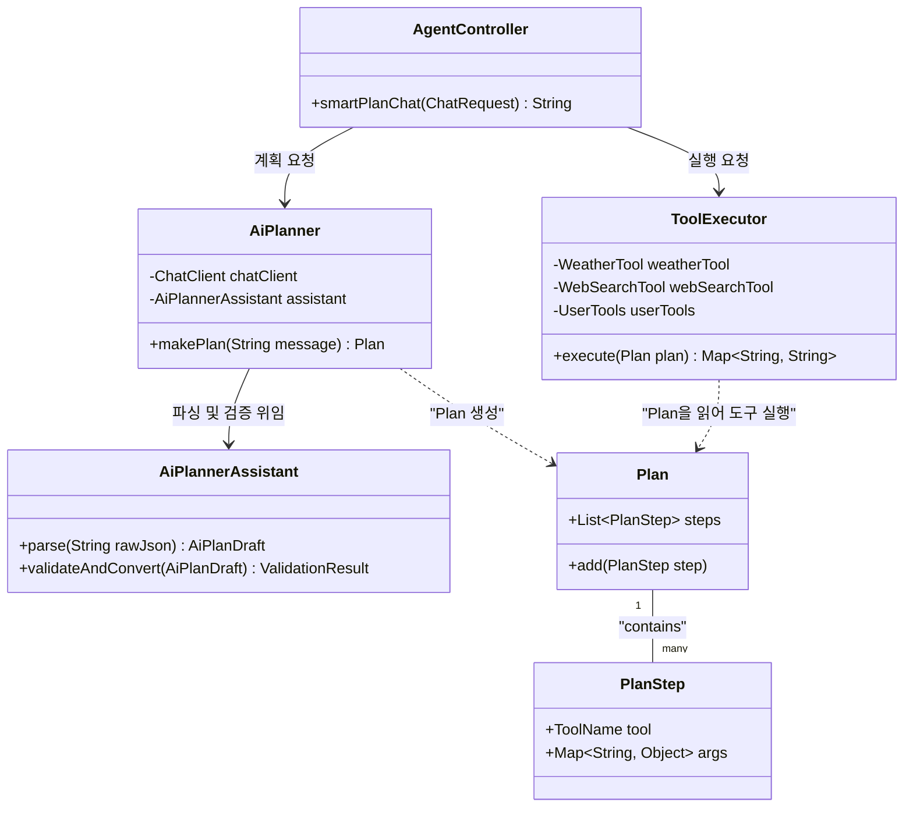
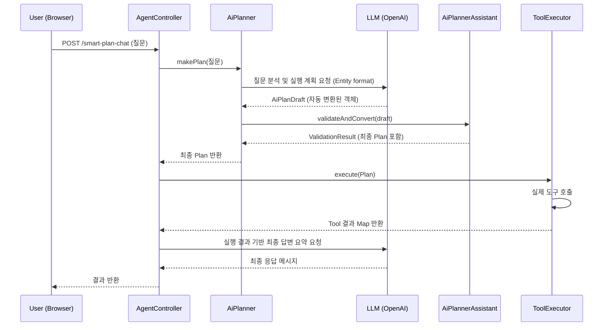

# @@DELETE_FILE:
# Smart AI Planner Architecture

이 문서는 Spring AI를 활용한 전략적 실행 계획 수립 및 도구 실행 엔진인 **Smart AI Planner**의 아키텍처와 작동 원리를 설명합니다.

---

## 1. 개요: 왜 Smart AI Planner가 필요한가?

시스템은 기본적으로 LLM이 도구를 즉시 호출하는 **Standard Mode**를 제공합니다. 하지만 서비스가 복잡해짐에 따라 다음과 같은 고찰이 이루어졌습니다.

### 1.1. Standard Mode (Native Function Calling) 분석
*   **특징**: LLM이 질문을 받자마자 필요한 도구를 실시간으로 결정하고 즉시 실행합니다.
*   **장점 (Pros)**: 
    *   **빠른 응답**: 단일 LLM 호출로 결과까지 도출되므로 지연 시간이 매우 짧습니다.
    *   **단순함**: 구조가 간단하여 단발성 질문(예: "오늘 날씨 어때?") 처리에 매우 효율적입니다.
*   **단점 (Cons) & 한계**:
    *   **근시안적 판단**: 복합 미션(Step 1 결과에 따라 Step 2가 결정되는 경우)에서 전체 맥락을 놓치고 잘못된 도구를 먼저 호출하는 경우가 발생합니다.
    *   **실행 가시성 부재**: 사용자는 AI가 내부적으로 어떤 도구를 어떤 순서로 쓰려는지 실행이 끝나기 전까지 알 수 없습니다.
    *   **검증 불가능**: 도구가 실행되기 전에 파라미터가 유효한지 검증할 단계가 없어, 잘못된 인자로 인한 런타임 에러에 취약합니다.

### 1.2. 개선 방향: "Think Before You Leap"
위와 같은 한계를 극복하기 위해, 실행 전 **전략적 계획(Planning)** 단계를 분리한 **Smart AI Planner**를 설계하였습니다. 이는 복잡한 문제를 작은 단위의 실행 가능한 단계(Step)로 선분해하고, 이를 검증한 뒤 서버가 통제권을 가지고 실행하는 방식입니다.

---

### 1.3. Mode Comparison Summary

| 비교 항목 | Standard Mode (Planner 미사용) | Smart AI Planner Mode (Planner 사용) |
| :--- | :--- | :--- |
| **핵심 매커니즘** | Native Function Calling (즉시 실행) | **Strategic Planning (계획 후 실행)** |
| **작동 단계** | 1단계: 질문 분석 및 도구 즉시 호출 | 3단계: 계획 수립 ➔ 서버 실행 ➔ 결과 요약 |
| **추론 능력** | 단순/단발성 작업에 최적 | **복합 미션/연쇄 추론**에 강력 |
| **가시성** | AI 내부에서 판단 후 결과만 출력 | 실행될 **Step 리스트를 사전에 확인** 가능 |
| **데이터 안정성** | AI가 실시간 판단 중 실수할 가능성 존재 | 검증된 `Validator`를 통해 실행 전 오류 차단 |
| **권장 상황** | 빠른 응답이 필요한 단순 정보 조회 | 높은 신뢰성이 필요한 복합 업무 수행 |

---

## 2. Class Diagram

---

## 3. Sequence Diagram

---

## 4. Key Features

### 4.1. Structured Output Integration
- Spring AI의 `.entity(AiPlanDraft.class)` 기능을 활용하여 LLM의 응답을 별도의 파싱 로직 없이 타입 안정성이 확보된 Java 객체로 직접 수신합니다.
- 복잡한 JSON 스키마를 프롬프트에 자동으로 주입하여 AI가 정확한 규격에 맞춰 계획을 수립하도록 유도합니다.

### 4.2. Strict Validation
- `AiPlannerAssistant`를 통해 AI가 수립한 계획에 존재하지 않는 도구가 포함되어 있거나 필수 인자(Parameter)가 누락되었는지 사전에 정밀 검증합니다.
- 검증 실패 시 안전한 Fallback 로직(예: 빈 계획 반환)을 통해 런타임 오류를 방지합니다.

### 4.3. Pure Fact Summary
- 최종 응답 단계에서 LLM은 오직 `TOOL_RESULTS`에 포함된 정보만을 바탕으로 답변을 작성하도록 제한되어 있어, 환각(Hallucination) 현상을 최소화합니다.
